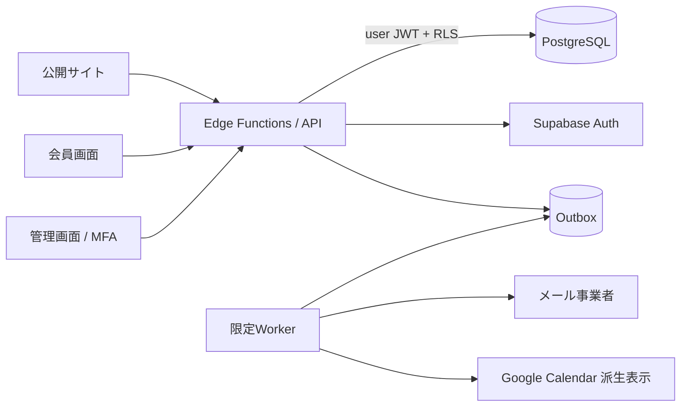

# Sky Rent 本番化実装ハンドオフ v1

更新日: 2026-09-16
対象: グロースレンタカー公開予約サイト・会員画面・管理画面

## 0. 結論と利用制限

このリポジトリは **公開デモとしては利用可、本番利用は No-Go** です。現行データはブラウザの `localStorage` にあり、本人認証、管理者権限、予約競合のDB制約、個人情報保護、監査、バックアップ復元、法令上必要な表示・同意が本番水準ではありません。

以下が完了するまで、実在する顧客の氏名、電話、メール、免許情報、予約、請求情報を入力しないでください。

- [受入・Go/No-Go](acceptance.md) の Critical / High と法務ゲートが全件合格
- 本書第13章 A〜P の owner・回答・承認日が確定
- 許可・会社・料金・約款等の実値を [法務公開ページ案](legal/README.md) に反映
- 日本法の専門家、事業責任者、個人情報管理責任者が公開文面を承認

本書は実装仕様であり法律意見書ではありません。貸渡約款や取消・免責条項をテンプレートのまま公開せず、管轄運輸支局への届出・許可内容と一致させてください。

## 1. この設計パック

- [現状監査](current-state-audit.md): 再利用可・要置換・本番禁止、コード根拠、仕様差分
- [データモデル](data-model.md): テーブル、制約、RLS、transaction、保持・削除
- [OpenAPI 3.1](openapi.yaml): 公開・会員・管理 API の実装契約
- [受入・Go/No-Go](acceptance.md): 実装チケット、完了条件、試験、法務ゲート
- [法務公開ページ案](legal/README.md): 必須・条件付き表示と公開前テンプレート
- [公開用ランディング](index.html): GitHub Pages から読むための入口

`sky-rent` を正本とします。`sky-rent-preview` はレビュー用 snapshot であり、実装・DB migration・本番デプロイの起点にしません。

## 2. 推奨基盤と承認事項

v1 の第一候補は **Supabase（PostgreSQL / Auth / Edge Functions）**、東京リージョン、DB時刻UTC、営業日と表示は `Asia/Tokyo` です。予約・会員・請求・ポイントを外部キーとtransactionで守り、PostgreSQL range / exclusion constraintで同一車両の重複期間をDBでも拒否します。

正式採用前に plan、PITR、RPO/RTO、月額上限、データ処理契約、リージョン、障害連絡、サービス終了時のexportをADRへ記録します。

一次資料:

- [Supabase Database](https://supabase.com/docs/guides/database/overview)
- [Row Level Security](https://supabase.com/docs/guides/database/postgres/row-level-security)
- [Auth architecture](https://supabase.com/docs/guides/auth/architecture)
- [Multi-Factor Authentication](https://supabase.com/docs/guides/auth/auth-mfa)
- [Edge Functions](https://supabase.com/docs/guides/functions)
- [利用可能リージョン](https://supabase.com/docs/guides/platform/regions)
- [バックアップとPITR](https://supabase.com/docs/guides/platform/backups)
- [PostgreSQL range型](https://www.postgresql.org/docs/current/rangetypes.html)
- [PostgreSQL exclusion constraint](https://www.postgresql.org/docs/current/ddl-constraints.html#DDL-CONSTRAINTS-EXCLUSION)

Firestoreは次点、Google Apps Scriptは本番予約基盤に採用しません。現行 `js/api.js` は `GAS_URL` を読んでもHTTP通信せず、`gas/` も旧車両・予約の試作に限られます。

## 3. 信頼境界

- PostgreSQLだけを予約・料金・権限・請求・ポイントの正とする。
- Google Calendar、メール、帳票は派生先。失敗しても予約transactionを巻き戻さずoutboxで再試行する。
- ブラウザから届く価格、割引、member ID、invoice資格、状態、permission、location scopeを信頼しない。
- 通常操作は `anon` key + user JWT を引き継いでRLSを通す。
- ユーザー起点の複数表transaction RPCもuser JWTで呼び、actor、active status、permission、scope、AAL2、`If-Match`をRPC内で再検証する。
- `service_role` はmigration/import/outbox/system jobの秘密環境だけ。interactive APIの汎用CRUD、ブラウザ、GitHub、ログへ出さない。

## 4. 日本国内向け法務・表示ゲート

### 4.1 自家用自動車有償貸渡事業

レンタカー業は道路運送法上の許可を前提とします。公開前に、正式な貸渡人名称・住所・代表者、営業所、許可情報、貸渡料金、貸渡約款、保険・補償、車両区分が管轄運輸支局の許可・届出内容と一致することを確認します。許可番号のWeb表示が必要かは管轄運輸支局と法務担当へ確認し、推測値を掲載しません。

料金と貸渡約款は借受人へ明示する必要があり、ウェブ掲載は認められた方法の一つです。オンライン予約では全ページfooterと最終確認画面から到達でき、予約時に適用versionを固定します。運転者の紹介・あっせんを行わない旨も明示します。貸渡簿は法定項目を貸渡終了から2年間保存します。レンタカー型カーシェアリングを除き、貸渡証を所定事項・注意事項付きで書面または電磁的方法により交付し、運転者へ携行を指示します。前年4月1日から当年3月31日までの車種区分別の車両数・延貸渡回数・延貸渡日車数・延走行キロ・総貸渡料金（該当時はカーシェアリング内訳）と、3月31日時点の全配置事務所の名称・所在地・車種区分別車両数を、管轄運輸支局ごとに別葉とした現行様式で生成し、主たる事務所所在地を管轄する運輸支局長へ毎年5月31日までに提出できる帳票・証跡を実装します。拠点の改名・移転・開閉や車両の移管・車種区分変更・廃車は業務発効日付き履歴で保持し、過去年度の帳票を生成時の現行masterから復元しません。

損害賠償 / NOC、保険・補償、事故・故障・盗難、違法駐車、返還遅延の貸渡前明示は、国交省通達上の「明示するよう努めること」という指導事項である。本設計では、安全・紛争予防のため法定義務との表現を混同せず、内部の公開 Blocker とする。

参考:

- [レンタカー事業について（北海道運輸局）](https://wwwtb.mlit.go.jp/hokkaido/bunyabetsu/jidousya/index_00002.html)
- [許可条件・貸渡簿・貸渡証・年次報告（国土交通省）](https://wwwtb.mlit.go.jp/hokkaido/content/000269958.pdf)
- [貸渡実績報告の作成・現行様式（北海道運輸局）](https://wwwtb.mlit.go.jp/hokkaido/shinseinavi.renta109.html)

### 4.2 通信販売・最終確認画面

インターネットで有償役務の申込みを受ける構成は、決済が現地でも特定商取引法の通信販売に当たり得る前提で設計し、最終判断を専門家へ確認します。少なくとも以下を実装します。

- 「特定商取引法に基づく表記」への明瞭なリンク
- 事業者名、代表/責任者、所在地、電話、連絡方法
- 税込対価、対価以外の負担、支払時期・方法、役務提供時期
- 予約の成立時点、申込期限がある場合の期限、変更・取消・返金・NOC等
- 最終確認画面に車両/数量、貸渡期間・拠点、option、総額、支払、提供時期、取消条件を一覧表示
- 確定直前に内容を訂正でき、ボタン文言を「上記内容で予約を申し込む」等の誤認しない表現にする
- 最終確認snapshot、適用文書version、同意時刻、request IDを改ざん耐性のある形で保存

参考:

- [通信販売広告の表示事項（消費者庁）](https://www.no-trouble.caa.go.jp/what/mailorder/advertising.php)
- [通信販売の申込み段階における表示ガイドライン（消費者庁）](https://www.caa.go.jp/policies/policy/consumer_transaction/amendment/2021/notice02/)
- [最終確認画面の6項目（消費者庁）](https://www.caa.go.jp/notice/assets/consumer_transaction_cms203_240315_02.pdf)

### 4.3 個人情報保護

入力フォームで直接個人情報を取得する前に、具体的な利用目的を明示します。privacyページには、個人情報取扱事業者の正式名称・住所・代表者、全利用目的、取得項目、委託、第三者提供、共同利用の有無、国外移転、保存期間、安全管理措置の概要、開示・訂正・利用停止等の手続と手数料、苦情窓口、改定日を掲載します。

- 予約段階の免許番号は、必要性・目的・閲覧role・短期保持期間が承認されるまで保存しない。貸渡開始時は法定貸渡簿に必要な全運転者の免許種類・番号を暗号化し、貸渡終了から最低2年保存する。
- 通常画面は末尾4桁またはmaskのみ。全文は専用permission + AAL2 + 閲覧理由 + audit。
- marketing同意は予約・会員登録の条件にせず、未選択を既定とする。
- 漏えい等runbookには、対象事態の判定、個人情報保護委員会への速報/確報、本人通知、証跡を含める。

参考:

- [個人情報保護法ガイドライン（通則編）](https://www.ppc.go.jp/personalinfo/legal/guidelines_tsusoku/)
- [漏えい等の対応](https://www.ppc.go.jp/personalinfo/legal/leakAction/)

### 4.4 外部送信・Cookie等

本番導入する全script/SDKをinventory化します。第三者analytics、広告、地図、動画、chat、error tracking等が端末情報を外部送信する場合は、適用判断を行い、送信情報、送信先事業者、当社と送信先双方の利用目的、停止方法を「外部送信ポリシー」で容易に確認できるようにします。不要なtrackerは導入しません。

参考: [外部送信規律FAQ（総務省）](https://www.soumu.go.jp/main_sosiki/joho_tsusin/d_syohi/gaibusoushin_kiritsu_00002.html)

### 4.5 約款・広告メール

- 貸渡約款・利用規約の全部免責、故意/重過失まで免責する条項、不当に解除権を奪う条項を禁止し、消費者契約法レビューを受ける。
- 契約通知とmarketingメールを分離する。広告メールは事前opt-in、拒否方法、送信者表示、承諾/拒否記録を実装する。
- 承認文書は改変不可versionとして保存し、予約snapshotから後日再現できるようにする。

参考:

- [消費者契約法の不当条項（消費者庁）](https://www.caa.go.jp/policies/policy/consumer_system/consumer_contract_act/public_relations/assets/consumer_system_cms101_231107_01.pdf)
- [通信販売の電子メール広告opt-in（消費者庁）](https://www.no-trouble.caa.go.jp/what/mailorder/)

## 5. 公開・会員・管理API

[OpenAPI](openapi.yaml)を唯一のHTTP契約とします。主な境界:

- 公開: catalog、availability、quote、公開中の法務文書、予約、guest照会/取消、問い合わせ
- 会員: profile、本人予約、point/coupon、本人invoice、本人問い合わせ
- 管理: catalog、料金revision、休業、整備block、予約状態、PII専用閲覧、入返金、会員、請求、問い合わせ、staff/RBAC、audit、settings

全管理operationは `x-required-permissions`、`x-location-scope`、`x-requires-aal2: true` を持ちます。通常の会員・予約・問い合わせ応答は免許全文を返しません。完全な連絡先・免許情報は専用endpoint、理由header、AAL2、auditが必要です。

変更APIは目的に応じて次を強制します。

- `Idempotency-Key`: 予約・問い合わせ・請求・入返金等。匿名clientはUUIDv4または16 random bytes以上（base64urlなら22文字以上）を生成する。事前Cookieは不要とし、serverはsecret付きHMACでscope化して原文を保存・logしない。
- `If-Match`: 更新・状態遷移・取消。古いETagは副作用なしで拒否。
- `X-CSRF-Token`: Cookie認証の変更操作。
- `X-Guest-Token`: guest予約所有確認。viewは短命・期限内再利用、cancelは一回使用。

errorは `application/problem+json`、`code`、`requestId`、field `errors`を共通化します。

## 6. 予約・在庫・料金transaction

予約期間はUTCの半開区間 `[start_at,end_at)`、数量1、物理車両1台をasset 1行とします。quoteは15分有効で在庫を確保しません。

予約確定は一transactionで次を実行します。

1. idempotency key + request hashを確保
2. quote未使用・期限・入力hash・公開中の法務versionを検証
3. asset、coupon、member請求資格を共通順序でlock
4. 料金revisionから再計算し、ブラウザ金額を無視
5. `asset_allocations` のrange exclusionで予約/整備を横断して重複拒否
6. reservation、option/価格snapshot、同意、status history、payment初期状態を保存
7. quote消費、coupon利用、outbox、auditを同時commit

競合は `409 AVAILABILITY_CONFLICT`、再送は最初の応答、同key別bodyは `409 IDEMPOTENCY_KEY_REUSED` とします。「検索して空いていたからINSERT」だけの実装は禁止します。

料金の正はversion化された `pricing_revisions` 以下です。assetやoptionに変更可能な現在価格を重複保存しません。JPY税込整数、端数、税、繁忙期、取消料、NOC、免責補償を承認fixtureで検証します。

## 7. 認証・権限・監査

- 資格情報、password hash、session、MFA secretはSupabase Authのみ。業務schemaへ複製しない。
- 会員はemail検証、列挙耐性のある登録/再設定応答、短寿命session、即時失効。
- 全staffはMFA。password直後はAAL1、管理APIはverify後のAAL2のみ。
- 初期role: `viewer`, `maintenance`, `store_staff`, `accounting`, `admin`。permission + 拠点scopeをDB最新値で毎回評価。
- auditはappend-only。成功/拒否/失敗、actor type、role snapshot、job/import run、request ID、対象、理由、mask済み差分を保持。
- 一般管理者もaudit、ledger、status history、price lineを更新・削除できない。

## 8. 個人情報・保持・削除

暫定値であり、判断N/Pの法務承認まで実PII投入禁止です。

| 区分 | 暫定方針 |
|---|---|
| 未使用quote/idempotency/token | 期限後削除。idempotencyは24時間以上保持 |
| 免許番号 | 予約段階は原則非保存。承認時のみ短期field暗号化。貸渡簿は法定項目としてfield暗号化し終了後最低2年。通常表示はlast4 |
| 予約・請求・支払 | 会計・紛争・許可運用に必要な承認期間を保持後、識別子を匿名化 |
| 問い合わせ・メール | 承認SLA/法務期間後に本文・宛先を削除/匿名化 |
| audit/import | partition、改ざん防止、legal hold、承認期間後の廃棄 |
| backup | PITR、暗号化、復元後の再削除手順を持つ |

退会はprofileをclosed → PII redaction → session失効 → Auth FK null化 → Auth user削除の再実行可能なworkflowにします。予約・請求・台帳・同意・監査の参照整合と必要なsnapshotは保持します。

## 9. 通知・非同期処理

予約、問い合わせ、請求を先にcommitし、同transactionでoutboxを追加します。workerはdedupe、指数backoff、上限、dead-letter、再送UI、provider webhook、bounce/suppressionを持ちます。本文・token・emailを通常logへ出しません。

marketingは別consentとし、transactional通知に広告を混在させません。予約・会員登録・問い合わせのcheckboxは任意かつ既定OFFとし、選択結果、文書version、opt-in/declined/withdrawalをappend-onlyで保存します。会員は設定画面から変更でき、各広告メールにはlogin不要の停止導線を設けます。停止tokenはURL query、referrer、analytics、通常logへ出さず、公開landingのfragmentから専用headerへ移して即時にsuppressionへ反映します。

## 10. 環境・CI/CD・運用

development / staging / productionはSupabase project、DB、Auth user、key、送信domainを分離します。previewからproduction dataへ到達させず、stagingへ実PIIをコピーしません。

CI必須:

- lint、unit、integration、OpenAPI lint/ref/operationId、migration dry-run
- RLS allow/deny、IDOR、CSRF、MFA、PII mask、rate limit
- 20並列の予約競合、idempotency、coupon/point/invoice/payment concurrency
- secret scan、dependency/SAST、生成物のcommit対応、prod承認
- 法務文書versionと最終確認snapshotのE2E
- backup復元・件数/金額/参照整合・削除再適用

監視対象はavailability/quote/reservation成功率、DB constraint、outbox遅延、認証失敗、MFA、403増加、PII閲覧、dead letter、backup/PITR、法務文書取得失敗です。RPO 15分 / RTO 4時間は事業判断Oの仮値です。

## 11. 移行

ブラウザlocalStorageとデモJSONを正本にしません。事業判断Mで旧データなしなら破棄します。移行する場合は source owner、manifest/checksum、dry-run、型/参照/重複/金額検証、id mapping、再実行安全性、rollback、件数/残高/金額の突合、PII安全経路を必須にします。password/hash/session/tokenは移行禁止です。

## 12. 実装順

1. `ADR-01` 基盤・domain・メール・監視・法務適用判断
2. `ENV-01` dev/staging/prod分離
3. `LEGAL-01` 許可/会社情報・約款・料金・privacy等の承認原稿
4. `DB-01` schema、制約、migration、seed
5. `AUTH-01/02` 会員Auth、staff MFA/RBAC/scope
6. `API-01` 公開catalog、availability、quote、予約、問い合わせ
7. `API-02` 管理API、料金、整備、入返金、請求、監査
8. `FE-01` 公開UIをAPI・最終確認・法務同意へ移行
9. `ADM-01` 管理UIをAAL2 APIへ移行
10. `NOTIFY/PII/AUD/MIG` 通知、保持削除、監査、必要時のみ移行
11. `CI/BKP/OBS/OPS/TEST` 復元、監視、runbook、受入
12. `CUT-01/GO-01` 本番相当rehearsal、公開判定

既存UIを先にremote storeへ差し替えるだけの実装は行いません。DB/Auth/APIを先に作り、画面をAPI単位で段階移行します。

## 13. 実装開始前の事業判断 A〜P

| ID | 判断事項 | 推奨初期値 | 未回答時 |
|---|---|---|---|
| A | Supabase plan、予算、責任者 | 東京 + PITR可能な有料plan | production作成不可 |
| B | `www/admin/api` domain、送信domain | 分離 | Cookie/Auth不可 |
| C | v1商品・拠点 | 車両、北見・釧路 | master凍結不可 |
| D | 料金・税・端数・season・NOC | 税込JPY整数、version管理 | quote不可 |
| E | 営業時間、buffer、休業、整備 | 拠点calendar | 空き判定不可 |
| F | 予約成立、pending、変更・取消 | 15分hold、version同意 | 状態遷移不可 |
| G | guest予約・本人確認 | email短命token | guest UI不可 |
| H | 免許項目・取得時点・目的・閲覧・保持 | 予約時は原則非保存、貸渡時は法定貸渡簿へ暗号化し終了後最低2年 | 予約時番号保存禁止、貸渡開始不可 |
| I | staff、role、permission、拠点scope | 5 role + MFA | 管理公開不可 |
| J | 請求書資格、締日、様式、振込先 | 許可会員のみ | 請求公開不可 |
| K | メール事業者、差出人、template | opt-in分離 | staging送信のみ |
| L | 問い合わせ種別、担当、SLA、spam | DB受付 + queue | 公開不可 |
| M | 旧データと正本 | デモ破棄 | 移行不可 |
| N | 項目別保持、削除、委託、国外移転 | 法務承認 | 実PII投入不可 |
| O | traffic、RPO/RTO、障害連絡 | RPO 15分/RTO 4時間 | Go不可 |
| P | 正式事業者情報、許可、約款、料金・取消・補償、特商法・privacy・外部送信の承認 | 管轄運輸支局/専門家と照合 | 予約公開不可 |

## 14. Definition of Ready

- [ ] A〜Pすべてにowner、回答、承認日、証跡がある
- [ ] `LEGAL-01` の会社/許可/約款/料金/取消/補償/privacy等にplaceholderがない
- [ ] 貸渡約款・料金が許可/届出内容と一致し、専門家と事業責任者が承認
- [ ] 特商法の適用判断と最終確認画面fixtureが承認済み
- [ ] 個人情報台帳、利用目的、保持削除、安全管理、開示請求、漏えいrunbookが承認済み
- [ ] 外部送信inventoryが完成し、不要trackerがゼロ
- [ ] OpenAPI breaking change方針とownerが決定
- [ ] 料金、営業時間、状態遷移、取消のtest fixtureがある
- [ ] staff role/location matrixが承認済み
- [ ] migration対象がなし、または正本/照合基準が確定
- [ ] Phase 0受入が完了

これらが揃えば、最初の実装PRは `ENV-01 + DB-01` に限定して開始できます。
